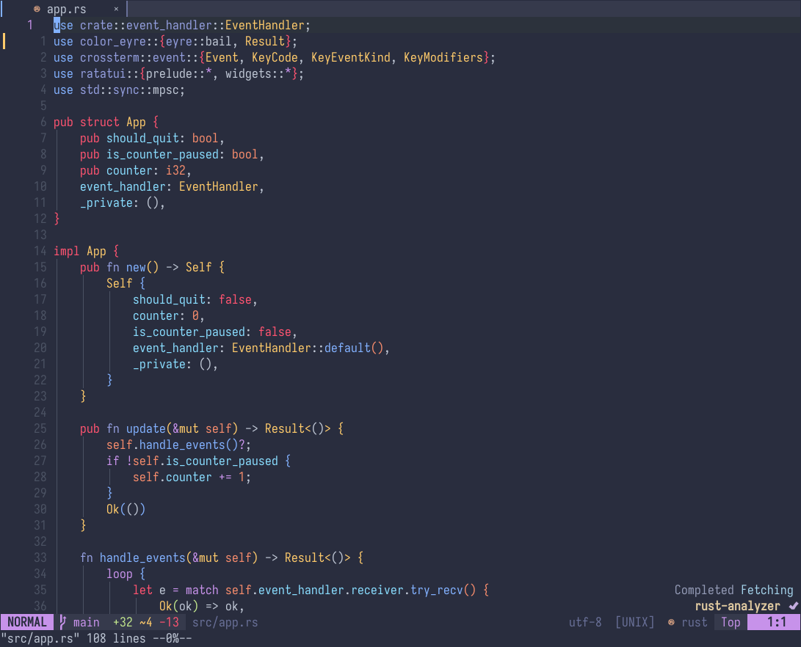

<div align="center">

# palenight.nvim



</div>

> [!NOTE]\
> This is a maintained hard fork of [drewtempelmeyer/palenight.vim][original-work].

Dark palenight colorscheme written in [Fennel][fennel] with full support for:
- Tree-sitter
- LSP *(including semantic highlighting)*
- True-color, 256 and 16 color palette terminals
- And [lots of plugins!](#plugin-support)

## Requirements

Neovim >=0.8 and the following option set:
```lua
vim.opt.background = "dark"
```

## Installation

<details><summary>Lazy</summary>

```lua
{ "alexmozaidze/palenight.nvim" }
```

</details>

<details><summary>Packer</summary>

```lua
use "alexmozaidze/palenight.nvim"
```

</details>

## Usage

```lua
vim.cmd.colorscheme "palenight"
```

## Setup options

> [!NOTE]\
> Setup is completely optional, you only need it to set options. Plugin loads by itself when you set colorscheme.

Here are the default options:
```lua
{
   -- Some terminals don't display italics very well,
   -- thus, they're disabled by default.
   italic = false,

   -- Fallback color palette for non-truecolor terminals,
   -- such as tty or some really old terminal.
   --
   -- Available options:
   -- "auto" => 16 color palette if in linux tty, 256 otherwise.
   -- 256    => 256 color palette.
   -- 16     => 16 color palette.
   cterm_palette = "auto",
}
```

## Plugin support

Many plugins are supported, the most important ones being:
- [lualine.nvim][lualine]
- [rainbow-delimiters.nvim][rainbow-delimiters]
- [gitsigns.nvim][gitsigns]
- [indent-blankline.nvim][ibl]
- [hlargs.nvim][hlargs]
- [nvim-hlslens][hlslens]
- [modicator.nvim][modicator]
- [marks.nvim][marks]
- [nvim-cmp][nvim-cmp]

For full list of supported plugins, see [groups.fnl][plugins-section].

If you have a plugin that isn't supported, feel free to file an issue or make a pull request!

## Overriding colors

Neovim already has an easy way of overriding colors of a colorscheme. Here's an example!

```lua
local colors = require "palenight/colors/truecolor"
local hl = vim.api.nvim_set_hl
local autocmd = vim.api.nvim_create_autocmd

autocmd("ColorScheme", {
   pattern = "palenight",
   callback = function()
      -- Directly setting a color
      hl(0, "Operator", { fg = colors.purple })
      -- Linking to another highlight group
      hl(0, "Operator", { link = "Macro" })
   end,
})
```

For list of available colors check out [colors/truecolor.fnl][colors].\
Also check out `:help nvim_set_hl()` and `:help nvim_create_autocmd()`.

---

If you want to change the *internal* color/group table - you can, but I don't know why you'd want this. Here's an example using Lazy:
```lua
{
   "alexmozaidze/palenight.nvim",
   init = function()
      -- Changing internal colors
      local colors = require "palenight/colors/truecolor"
      colors.comment = "#ff00ff"
      -- Changing internal group table
      local groups = require "palenight/groups"
      groups["@function"].fg = "#ff0000"
   end,
}
```

> [!IMPORTANT]\
> The order in which you require these modules is important. Require colors before requiring groups.

It's not recommended you modify the internals, but you can, and no one can stop you.

## Questions? Need help?

Hop over on [discussions][discussions] and ask away!

[discussions]: https://github.com/alexmozaidze/palenight.nvim/discussions
[nvim-cmp]: https://github.com/hrsh7th/nvim-cmp
[marks]: https://github.com/chentoast/marks.nvim
[plugins-section]: fnl/palenight/groups.fnl#L369
[fennel]: https://fennel-lang.org/
[modicator]: https://github.com/mawkler/modicator.nvim
[hlslens]: https://github.com/kevinhwang91/nvim-hlslens
[hlargs]: https://github.com/m-demare/hlargs.nvim
[ibl]: https://github.com/lukas-reineke/indent-blankline.nvim
[gitsigns]: https://github.com/lewis6991/gitsigns.nvim
[rainbow-delimiters]: https://gitlab.com/HiPhish/rainbow-delimiters.nvim
[lualine]: https://github.com/nvim-lualine/lualine.nvim
[tree-sitter]: https://github.com/nvim-treesitter/nvim-treesitter
[colors]: fnl/palenight/colors/truecolor.fnl
[original-work]: https://github.com/drewtempelmeyer/palenight.vim
[vimplug]: https://github.com/junegunn/vim-plug
[firaCode]: https://github.com/tonsky/FiraCode
